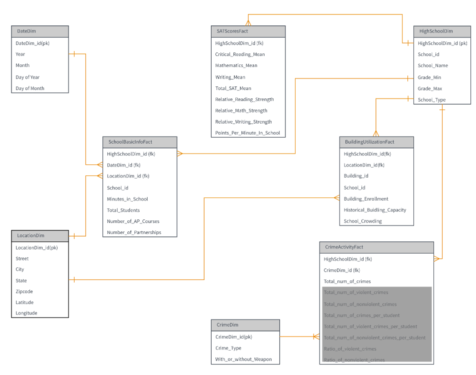
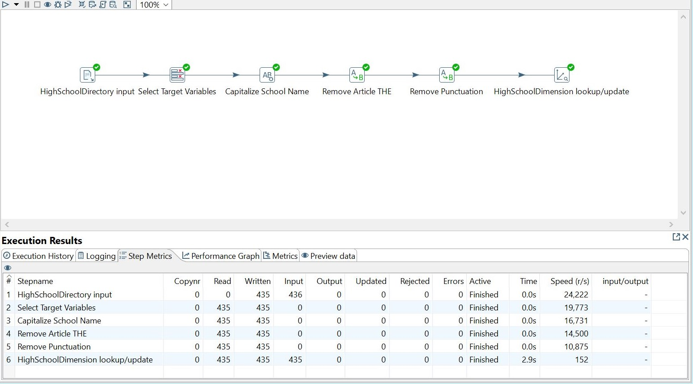
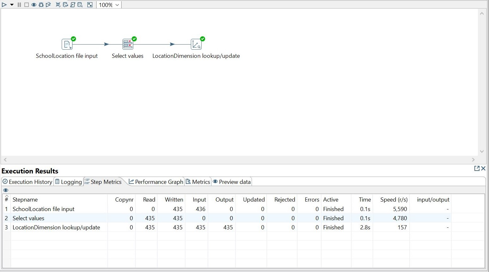
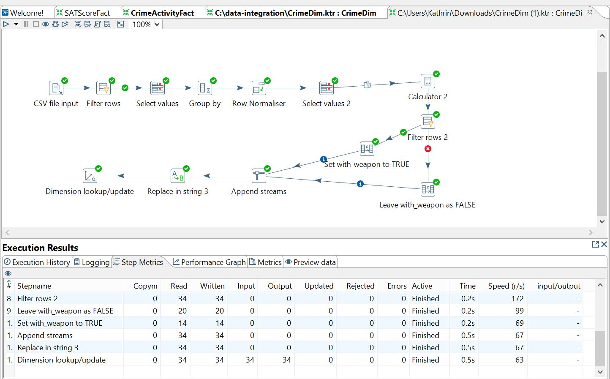
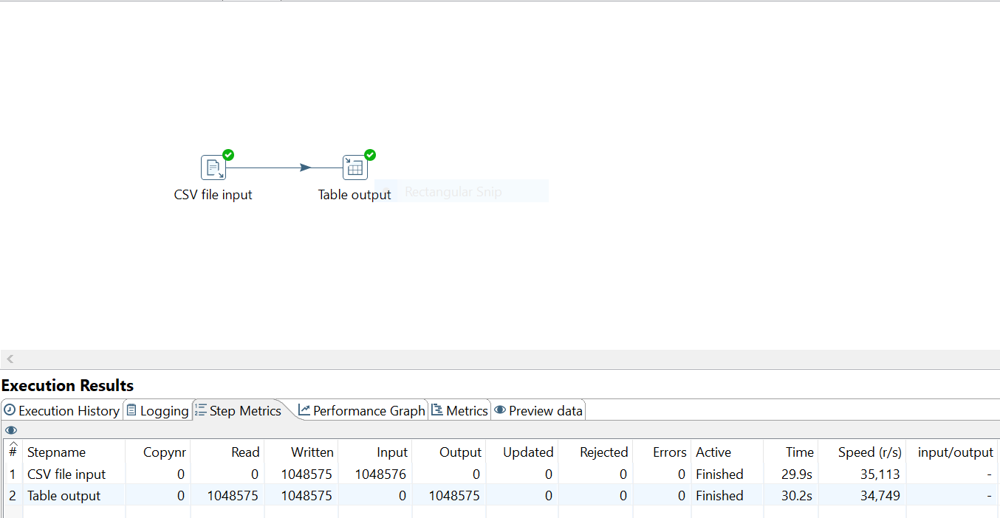
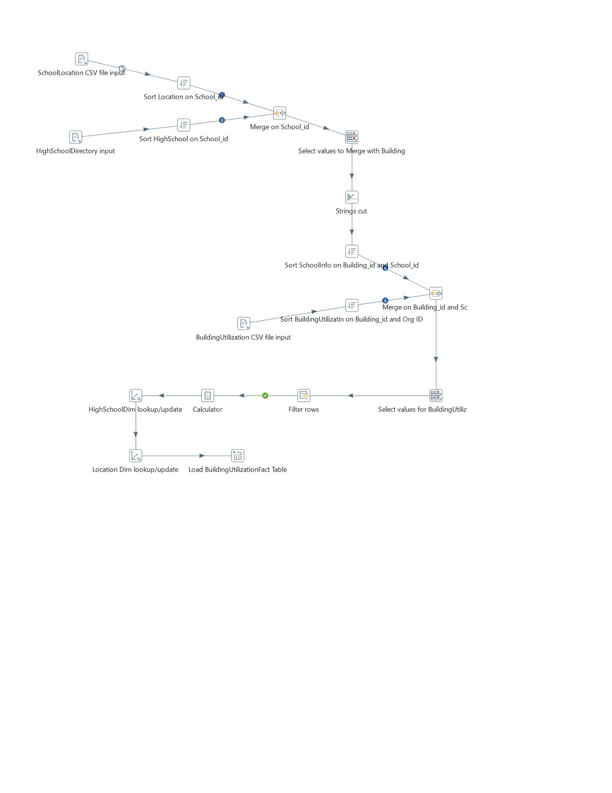
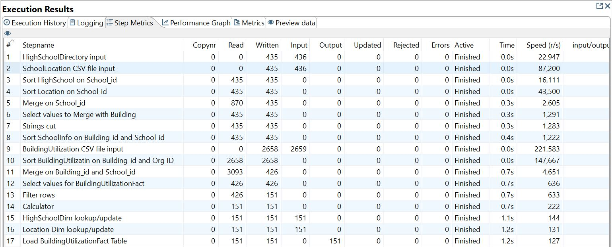
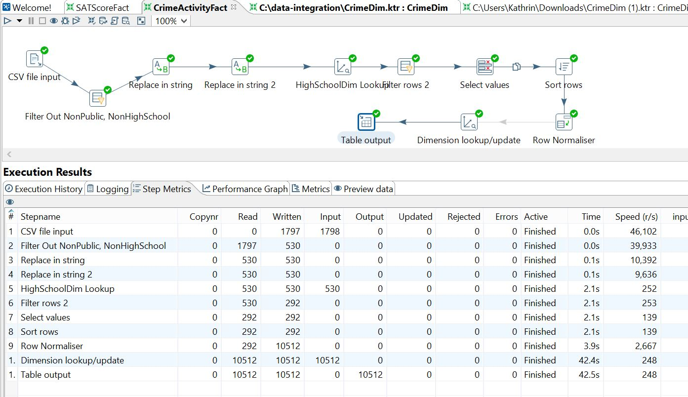
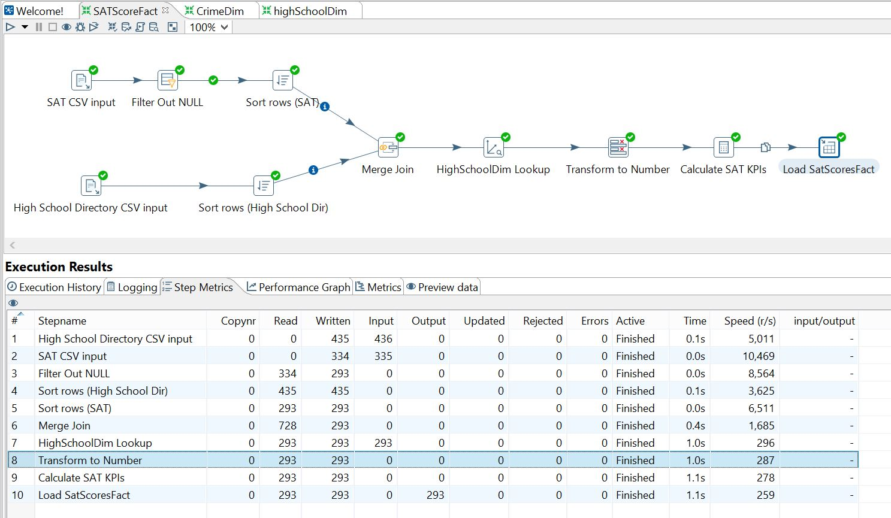
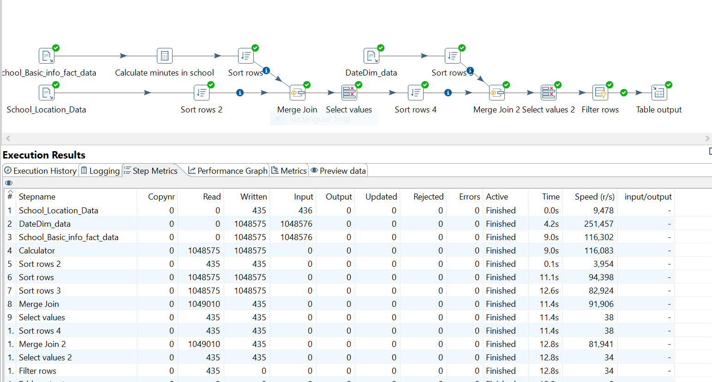

# NYC Public High School Data Warehouse

## Introduction
This data warehouse is for the benefit of the Department of Education (DOE) to obtain a more holistic view of the public high schools it serves and guide its policies and prioritize initiatives. It also provides information to other city and state public officials as well as parents as to the quality of schools. This database will bring together information about each public high school’s class and extracurricular offerings, school characteristics, building overcrowding information, school crime, and the average SAT scores of graduating seniors. This data warehouse will assist the DOE in identifying leading indicators of a failing school as well as possible roadblocks to student scholastic performance so that assistance to schools can be better prioritized.

## Data
In order to complete our data warehouse objectives, we identified the necessary data sources as follows:

* `SAT Scores of Students at NYC High Schools`: Average critical reading score, average mathematics score, average writing score, and total number of test takers for graduating seniors for that year (2010) by public high school. The data was accessed via the NYC Open Data website. This data set is curated by the Department of Education (DOE).

* `High School Directory`: Basic information about all NYC high schools including location, school district, school type, total number of students, advanced placement class offerings, sports offerings, start time and end time, and financial/cultural/corporate partners. The data was accessed via the NYC Open Data website. This data set is curated by the Department of Education (DOE).

* `School Building Enrollment Capacity and Utilization`: Enrollment, historical capacity and utilization data for every building and schools in those buildings. The data was accessed via the NYC Open Data website. This data set is curated by the School Construction Authority (SCA).

* `Public School Crime Data`: Annual counts of crimes committed at NYC public schools throughout the year. This data was retrieved from the NY State Education Department Website, and it is curated by the Student Support Services (SSS).

## Key Performance Indicators (KPIs)
The end users of this data warehouse concern the quality of NYC public schools mainly in terms of the overall performance of and safety issues around schools. Therefore, the KPI’s listed below focus on these aspects. 

**KPIs:** Test Takers to Total Senior Students Ratio, Average Total SAT Score, Relative Reading Strength, Relative Math Strength, Relative Writing Strength, Minutes in school per day, SAT points per minute in school, School Crowding, SAT Score by School Type, Ratio of Violent Crimes to Total Crime, Ratio of Non-violent Crimes to Total Crime, Number of Crimes per Student, Number of Violent Crimes per Student, Number of Non-violent Crimes per Student, Number of Crimes per Student by Crime Type and County

## Data Warehouse Dimensional Model
* Dimension Tables: DateDim, HighSchoolDim, LocationDim, CrimeDim
* Fact Tables: SATScoresFact, BuildingUtilizationFact, CrimeActivityFact, SchoolBasicInfoFact

*Note: Some KPIs originally included in the SATScoresFact and CrimeActivityFact table have been grayed out. These KPIs require information from more than one data source, so it was decided to calculate those KPIs on the fly as a part of the business analytics step.*

## ETL Process
### Dimension Tables:
HighSchoolDim  
High School Dimensional table shows basic information of a public high school, including school id, school name, minimum and maximum grade, and school type.

LocationDim  
Location Dimensional table includes address-related information, including Street, City, State, Zipcode, Latitude, and Longitude. In this steps, we selected target variables according to the finalized dimensional modeling. Then we created the dimension.

CrimeDim  
Crime Dimension provides the information about criminal activity in school. It has the following attributes: Crime Type, Crime Name and With or Without Weapon indicator. 

DateDim  

### Fact Tables:
Building Utilization Fact Table  
Building Utilization Fact Table links to two dimensional tables: High School Dim and Location Dim. It shows building id, the number of students enrolled in a building, the historical capacity of a building, and density of a building.

Crime Activity Fact Table  
This Fact Table links together two dimensions: Crime Dim and High School Dim. This table shows us school number, crime type, number of crimes and weather the crime was committed with or without the gun.   

SATScoresFact  
The SAT Scores Fact has the total average SAT scores by school. It required us to look up the high school dimension id from the HighSchoolDim (luckily, the natural key was consistent between the SAT data set and the High School Directory data set). Moreover, since the scope of schools included on the two data sets differed, we needed to source both data sets and merge join the results so as to not get any errors during the dimensional look up step. Lastly, the calculations for the KPIs were carried out prior to loading the Fact table.

SchoolBasicInfoFact  
The School Directory data set was pulled for this fact table and merged with location data. A calculation step determined the number of minutes in school. Lastly, the date dimension was brought in before the Fact table was loaded with the values.

## Dashboard
